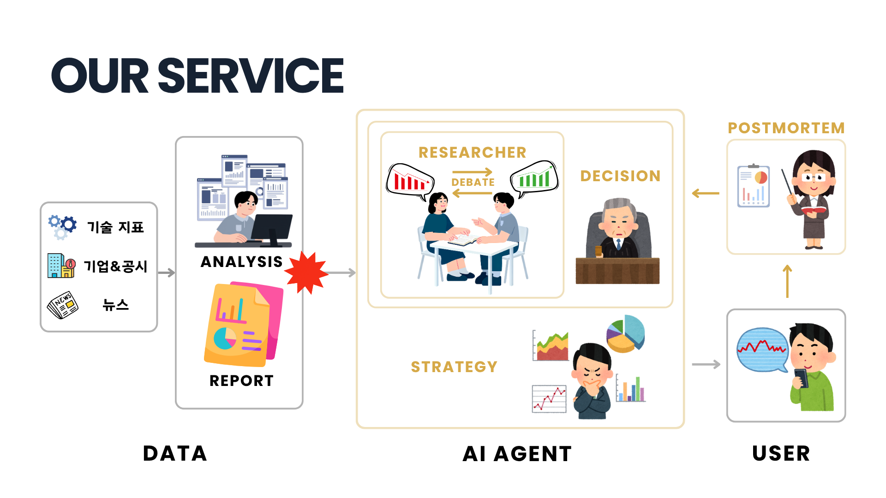
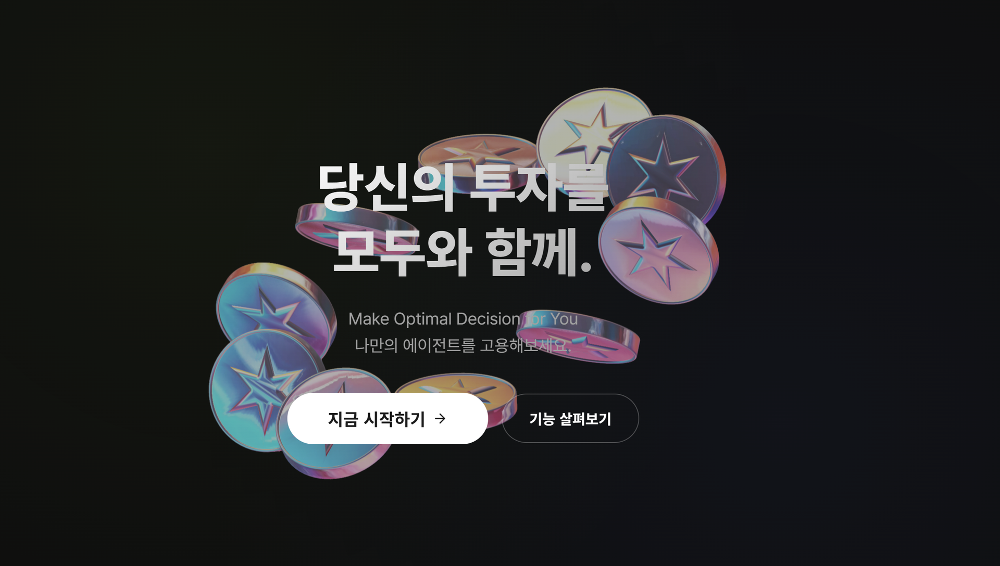
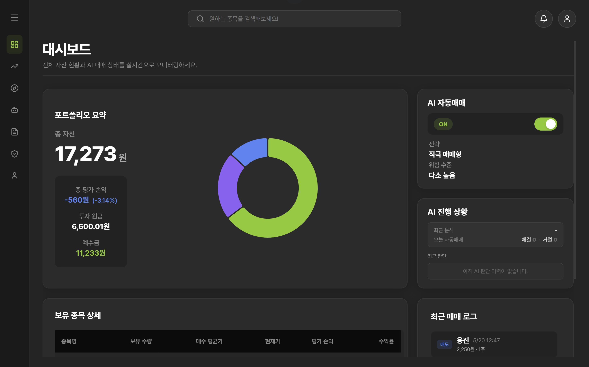
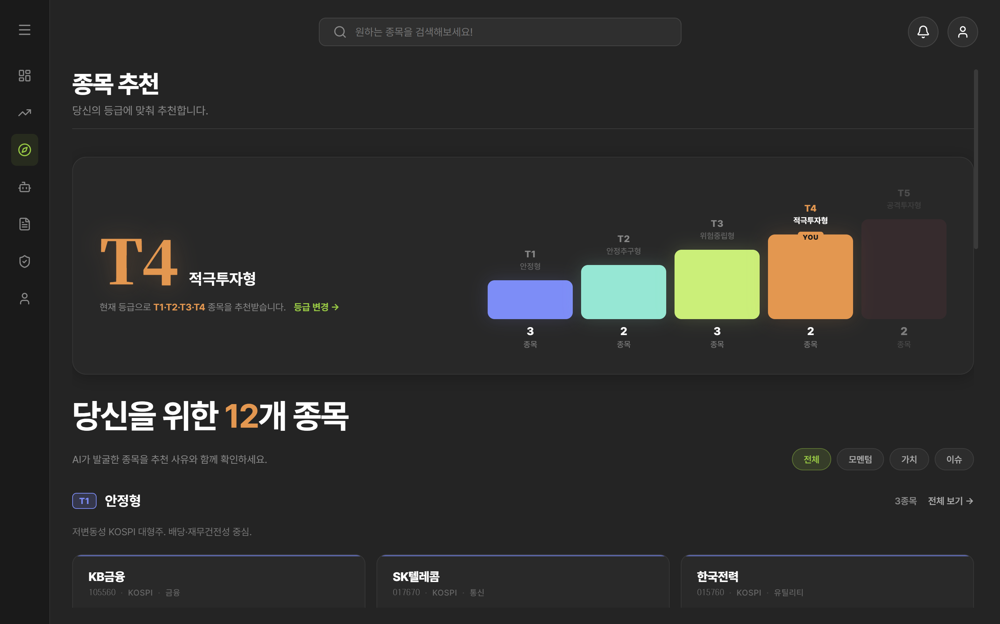
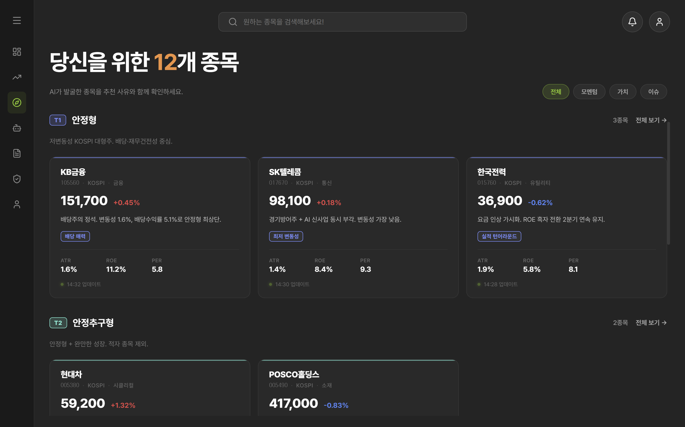
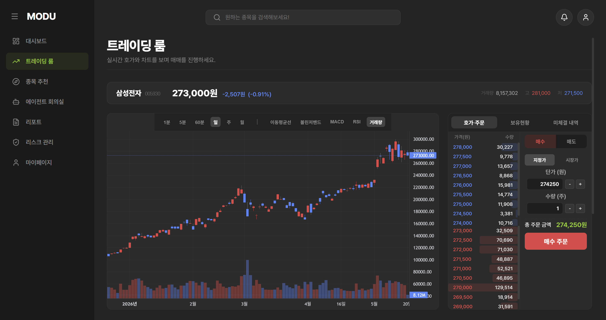
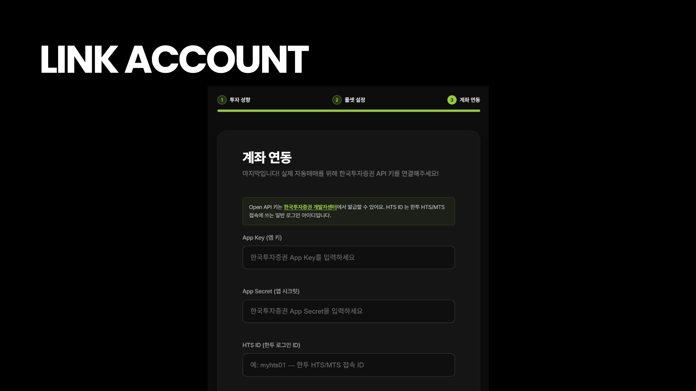
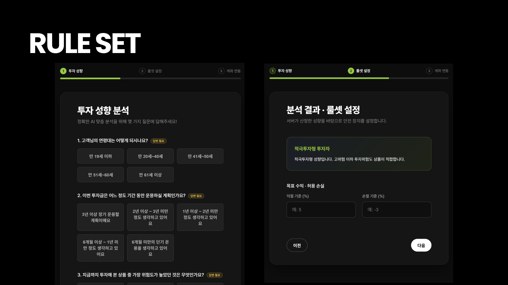
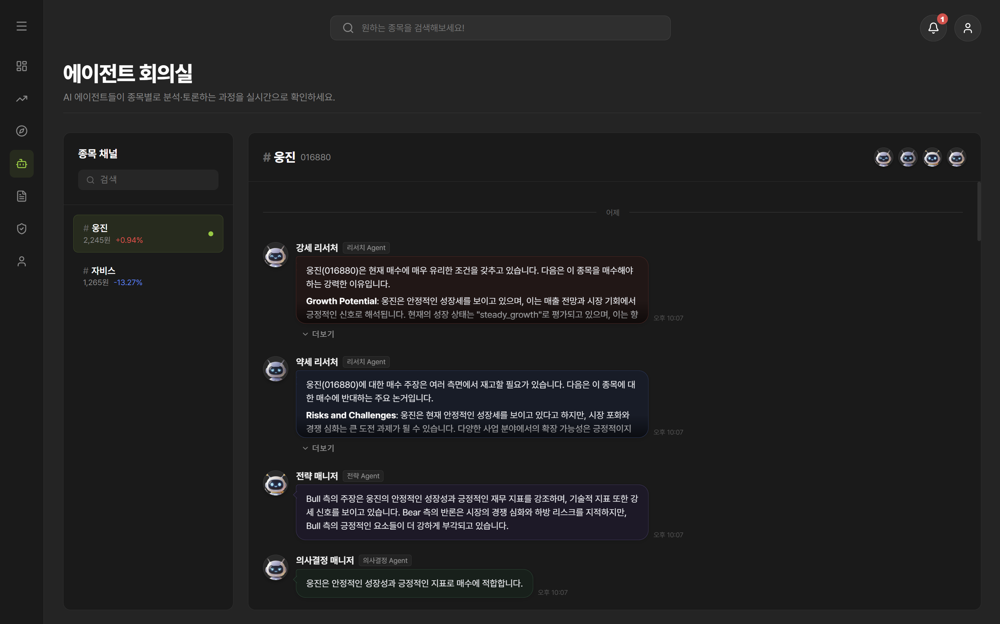

# MODU

> 모두를 위한 AI 주식 트레이딩 파트너

MODU는 개인 투자자가 시장 데이터를 해석하고, 자신의 투자 성향에 맞는 판단을 내릴 수 있도록 돕는 **AI Agent 기반 주식 트레이딩 의사결정 지원 서비스**입니다.

단순히 종목을 추천하거나 매수/매도 의견만 보여주는 것이 아니라, 시장 신호를 감지하고, 여러 Agent가 서로 다른 관점으로 분석한 뒤, 백엔드의 리스크 검증과 사용자 승인 흐름을 거쳐 실제 주문 시스템과 연결합니다.

MODU는 투자 판단을 보조하는 서비스이며, 최종 투자 결정과 책임은 사용자에게 있습니다.

---

## 구현된 서비스 흐름

MODU의 핵심 흐름은 코드 기준으로 다음과 같이 구성되어 있습니다.




---

## 주요 화면

### 홈



MODU의 서비스 가치와 주요 기능을 소개하는 랜딩 화면입니다.

### 대시보드



사용자는 자산 현황, 보유 종목, AI 판단 알림, 자동매매 상태를 확인합니다.

### 종목 추천



사용자의 투자 성향 등급 이하의 종목을 tier별로 큐레이션합니다. 백엔드는 `daily_fundamentals`, `risk_tier`, `volume_spike` 등 분석 데이터와 `stock_master`를 조합해 추천 목록을 구성합니다.



추천 종목은 단순 목록이 아니라 종목별 지표, 태그, 추천 근거와 함께 제공됩니다.

### 트레이딩 룸



실시간 시세, 차트, 관련 뉴스, 주문 가능 정보, 수동 주문 기능을 제공하는 거래 화면입니다. 주문 접수와 체결 결과는 SSE를 통해 사용자에게 실시간으로 전달됩니다.

### 계좌 연동



사용자는 한국투자증권 API 정보를 연동해 실시간 자산, 보유 종목, 주문 가능 금액, 주문/체결 내역을 MODU에서 확인할 수 있습니다.

### 리스크 관리



사용자는 투자 성향을 진단하고 손절률, 익절률, 일일 주문 한도, 일일 손실 한도, AI 주문 예산, 자동매매 상태를 설정할 수 있습니다.

### AI 에이전트 회의실



AI Agent의 발화 메시지를 종목별 채널에서 확인할 수 있습니다. 실시간 메시지는 주문 SSE 연결의 `agent-message` 이벤트로 수신하고, 채널 진입 시에는 REST API로 과거 메시지를 불러옵니다.

---

## 핵심 기능

### 1. 시장 신호 감지

`analysis_server`는 매 분 활성 종목을 순회하며 신호를 분석합니다.

- `signal_builder`: 종목별 분석 신호 생성
- `detection_engine`: 조건에 맞는 rule 감지
- `cooldown_manager`: 동일 신호의 반복 발화를 제한
- `event_publisher`: 유효한 trigger를 `market.signal.detected` 토픽으로 발행

뉴스 요약은 MongoDB의 `news_articles`를 조회해 부가 정보로 포함하며, 요약 실패가 trigger 발행 자체를 막지 않도록 설계되어 있습니다.

### 2. 사용자별 AI 판단 생성

AI Agent는 `market.signal.detected` 이벤트를 받아 보유자 또는 매수 후보 사용자에게 맞는 `UserTriggerEvent`로 변환합니다.

이후 LangGraph 파이프라인을 실행합니다.

```text
context_loader
  -> bull_researcher
  -> bear_researcher
  -> decision_manager
  -> strategy_manager
  -> risk_gate
```

운영 기본 모드는 `debate_1`이며, Bull/Bear 1라운드 토론 후 판단을 생성합니다. 실험용으로 토론 없는 `debate_0`, 2라운드 토론인 `debate_2`도 코드에 정의되어 있습니다.

### 3. Bull/Bear 기반 Multi-Agent 구조

MODU는 하나의 LLM이 바로 결론을 내리지 않습니다.

- **Bull Researcher**: 상승 가능성, 긍정적 신호, 매수 근거 분석
- **Bear Researcher**: 하락 가능성, 변동성, 손실 리스크 분석
- **Decision Manager**: Bull/Bear 토론 또는 signal을 종합해 투자 방향을 판단
- **Strategy Manager**: 판단 결과를 주문 가능한 `FinalDecision`으로 변환
- **Risk Gate**: LLM을 호출하지 않고 정책과 형식을 검증

토론 내용은 `investment_debate_state`에 시간순으로 누적되며, 이후 Decision Manager와 Strategy Manager가 공유 컨텍스트로 사용합니다.

### 4. 투자 성향과 리스크 룰셋

사용자는 리스크 관리 화면에서 투자 성향 설문과 거래 규칙을 설정합니다.

- 5단계 투자 성향 분류
- 손절률/익절률 설정
- 일일 최대 주문 횟수
- 일일 최대 손실 금액
- AI 주문 예산
- 자동매매 ON/OFF

자동매매 활성화 시 백엔드는 KIS 연동, 투자 성향 입력, 리스크 룰셋 설정 여부를 검증합니다. Kill Switch 상태에서는 자동매매가 차단됩니다.

### 5. AI 판단 승인 흐름

AI 판단은 바로 주문으로 이어지지 않을 수 있습니다. 백엔드는 판단 결과를 저장하고, 필요한 경우 `APPROVAL_REQUIRED` 상태로 사용자 승인을 기다립니다.

사용자는 승인 대기 목록에서 판단을 확인한 뒤 승인하거나 거부할 수 있습니다.

- 승인 시 주문 row 생성
- `trade.order.submitted` Kafka 발행
- 거부 시 판단 상태를 `REJECTED`로 변경
- 만료된 판단은 더 이상 승인할 수 없음

이 구조를 통해 AI 판단과 실제 주문 실행 사이에 사용자 확인 단계를 둘 수 있습니다.

### 6. 주문 및 체결 연동

백엔드는 한국투자증권 API를 통해 다음 기능을 제공합니다.

- 사용자 자산 조회
- 보유 종목 조회
- 종목 상세 시세 조회
- 캔들 데이터 조회
- 관련 뉴스 조회
- 주문 가능 금액/수량 조회
- 수동 매수/매도 주문
- 미체결 주문 조회
- 주문 정정/취소
- 거래 이력 조회

주문 접수, 실패, 체결 결과는 SSE로 전달됩니다. 프론트엔드는 이 스트림을 통해 알림, pending decision, agent message를 갱신합니다.

### 7. 판단 이력과 리포트

AI 판단은 `ai_judgments`에 저장되며, 사용자는 판단 이력을 페이지 단위로 조회할 수 있습니다.

주문과 연결된 판단은 상세 조회를 통해 당시의 근거와 지표 스냅샷을 확인할 수 있습니다.

- 판단 상태: `PASSED`, `HOLD`, `BLOCKED`, `APPROVAL_REQUIRED`
- Bull/Bear 주장
- 주요 신호
- 판단 당시 indicators snapshot
- 주문과 연결된 AI 판단 근거

### 8. Postmortem 피드백 루프

매도 체결 이후에는 Postmortem Agent가 판단 결과를 회고할 수 있도록 별도 feedback 흐름이 구성되어 있습니다.

사후 회고는 이전 판단의 적절성, 손익 결과, 개선점을 정리하고 이후 판단의 memory context로 활용될 수 있습니다.

---

## 프론트엔드 라우트

현재 프론트엔드는 다음 주요 화면으로 구성되어 있습니다.

| 경로 | 화면 |
| --- | --- |
| `/` | 랜딩 페이지 |
| `/login` | 로그인 |
| `/onboarding` | 온보딩 |
| `/home` | 대시보드 |
| `/trading` | 트레이딩 룸 |
| `/discovery` | 종목 추천 |
| `/agent-meeting` | AI 에이전트 회의실 |
| `/report` | AI 판단 리포트 |
| `/risk-manage` | 리스크 관리 |
| `/mypage` | 마이페이지 |

---

## 백엔드 도메인

| 도메인 | 역할 |
| --- | --- |
| Auth | 카카오 로그인, JWT 인증 |
| User | 사용자 정보 및 KIS API 키 관리 |
| Account | 자산 요약, 보유 종목 조회 |
| Market | 종목 검색, 시세, 캔들, 뉴스 |
| Discovery | 사용자 투자 성향 기반 종목 추천 |
| Strategy | 투자 성향, 리스크 룰셋, 자동매매 상태 |
| AI | AI 판단 이력, 승인 대기 판단, Agent 메시지 |
| Trading | 주문, 주문 가능 금액, 미체결, 거래 이력, SSE |

---

## 기술 스택

| 영역 | 기술 |
| --- | --- |
| Frontend | React, Vite, Axios, Sonner, CSS |
| Backend | Java 17, Spring Boot, Spring Security, JPA, Flyway |
| AI Agent | Python, LangGraph, LangChain, Pydantic |
| Analysis Server | Python, APScheduler, Redis, MongoDB, Kafka |
| Database | PostgreSQL, MongoDB, Redis |
| Messaging | Kafka |
| Trading API | Korea Investment Securities API |
| Infra | Docker, Docker Compose, Nginx, Kubernetes manifests, Jenkins |

---

## 저장소 구조

```text
.
├── frontend/          # React 기반 사용자 화면
├── backend/           # Spring Boot API 서버, 인증, 주문, AI 판단 저장
├── ai_agent/          # LangGraph 기반 Multi-Agent 판단 모듈
├── analysis_server/   # 시장 데이터 분석, trigger 감지, Kafka 발행
├── infra/             # Jenkins 및 Kubernetes 배포 설정
├── docs/              # 기획 및 개발 문서
├── assets/            # README용 서비스 화면 이미지
└── docker-compose.yml # 로컬 통합 환경 정의
```

---

## 주요 Kafka 토픽

| 토픽 | 역할 |
| --- | --- |
| `news.article.published` | 뉴스 수집 후 기사 발행 이벤트 |
| `market.signal.detected` | 분석 서버가 감지한 종목 단위 시장 신호 |
| `ai.trigger.requested` | 시장 신호를 사용자별 판단 요청으로 변환한 이벤트 |
| `ai.decision.generated` | AI Agent가 생성한 최종 판단 |
| `ai.agent.message` | Agent 발화 메시지 |
| `trade.order.submitted` | 백엔드가 주문 실행을 위해 발행하는 주문 이벤트 |
| `trade.order.executed` | KIS 체결 통보 이후 주문 체결 처리 이벤트 |
| `trade.settled` | 체결 이후 피드백 흐름에 사용되는 이벤트 |

---

## 프로젝트 팀원

| **Frontend** | **Backend** | **Data Analysis** | **AI** | **AI/Infra** | **PM/Infra** |
|:---:|:---:|:---:|:---:|:---:|:---:|
|  |  |  |  |  |  |
| [석정운](https://github.com/jeongunun) | [김민정](https://github.com/minjeongkimm) | [한가희](https://github.com/gahuily) | [김소원](https://github.com/Dae12-Han) | [박사랑](https://github.com/sweetpotatolove) | [소재헌](https://github.com/sojaeheon) |

---

MODU는 AI가 대신 투자하는 서비스가 아니라, 사용자가 더 근거 있는 판단을 할 수 있도록 시장 신호와 Agent 분석, 리스크 검증, 주문 흐름을 하나로 연결한 **AI 기반 투자 의사결정 파트너**입니다.
